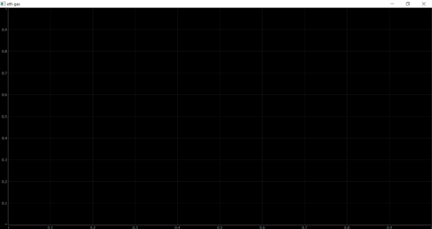
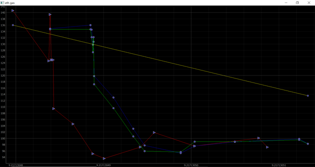

# Gas Price Estimator

This code was written so i could guage the gas prices and make transactions at the right time. The online gas estimators mostly refresh every **10-12 seconds** in this code the graph plots a new gas price every time it changes.

The project uses the alchemy API which provides the user with different blockchain metrics. Through which we can also interact with the blockchain using Web3.py or Web3.js
for more info visit: [Alchemy](https://www.alchemy.com/)

In this particulat project i have used a websocket to connect to the API so i can have a continous stream of data which i can then monitor for any changes and plot it. 

to see the program in action clone the directory using the following command:

>`git clone https://github.com/abdulsaboor19334/gas-estimator.git`

if the directory is cloned sucessfully type the command:

>`cd gas-estimator`

followed by 

> `python UI.py` 

this will open the following window.

after waiting for a few seconds this is what you will see 

This image looks very eratic due to the volatile nature of etherium gas.
1) The Red line shows the orignal gas price 
2) the green line is the weighted moving average of the orignal data with the most recent data being given the most weight. 
3) The blue link is the moving average of the of the orignal data 

*both WMA and MA take into account the last 3 data points in markets with lower volatility the number of three can be increased to asmuch as 200*

4) the yellow line is the trend line which is calculated using the method given in the following link.

[How to Calculate Trendline](https://classroom.synonym.com/calculate-trendline-2709.html)